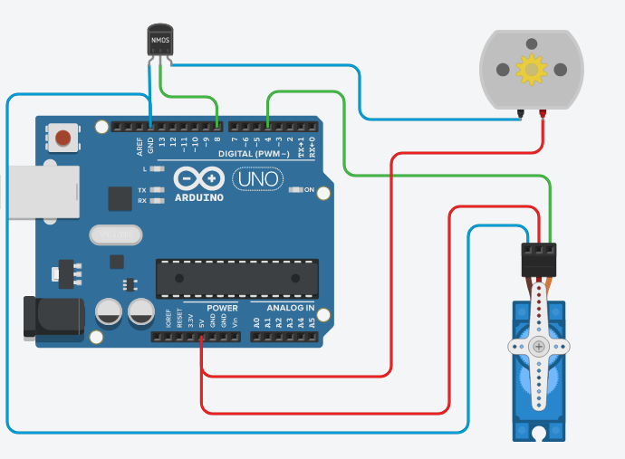
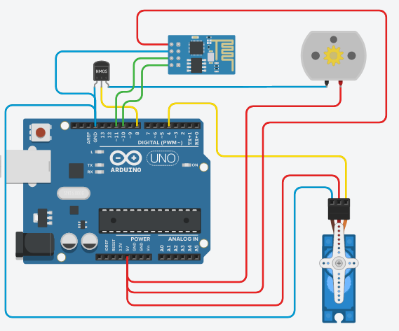

# Open Boat
Is an open source boat project. Simple, easy to do.

The main objective of this project is to create a boat as simple as possible, with almost what can come to hand.

The bluetooth module I used is a **BLE 4.0** module *(HM-10)* it is the only more delicate element to obtain, however we can easily replace it with a more classic bluetooth module *(HM-05)* or well, according to the desires, and the components that you have by a wifi module, or a RC receiver.

## Requierment
- Arduino
- DC Motor
- Servo Motor
- Mosfets MMOS
- Bluetooth Module (HM-10)

## Shema

*Simple shema, for a simple circuit without the bluetooth*

*Complete shema of the V1 of the system*
## Exemple
> I'll put some picture of my actual prototype in few time.