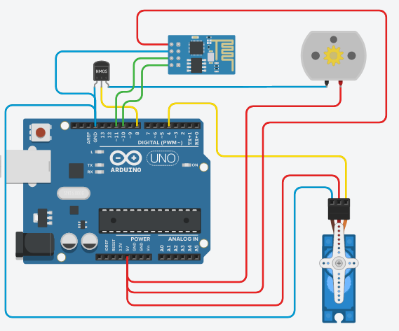
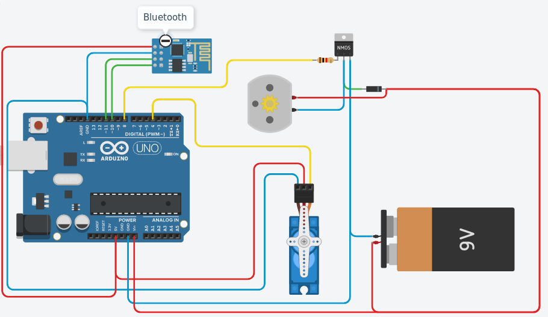

# Open Boat
Is an open source boat project. Simple, easy to do.

The main objective of this project is to create a boat as simple as possible, with almost what can come to hand.

The bluetooth module I used is a **BLE 4.0** module *(HM-10)* it is the only more delicate element to obtain, however we can easily replace it with a more classic bluetooth module *(HM-05)* or well, according to the desires, and the components that you have by a wifi module, or a RC receiver.

## Requierment
without the motor controller :
- Arduino
- DC Motor
- Servo Motor
- Mosfets MMOS
- Bluetooth Module (HM-10)

If you want to add the motor controller, in addition to the previous components you will need:
- NPN Transistor
- Diode (I use a 1N4007)
- Resistor 1KΩ (or something close to it)

In this version, you don't need the MMOS Mosfets

## Shema

|Without the bluetooth module|With Blutooth module, and the most simple version, don't have motor controller just turn it ON/OFF|With the motor controller and the bluetooth|
|-----------|---------|----------|
||||
|*Simple shema, for a simple circuit without the bluetooth*|*Complete shema of the V1 of the system*|*Adding a Digital Motor controller*|

## Exemple
> I'll put some picture of my actual prototype in few time.